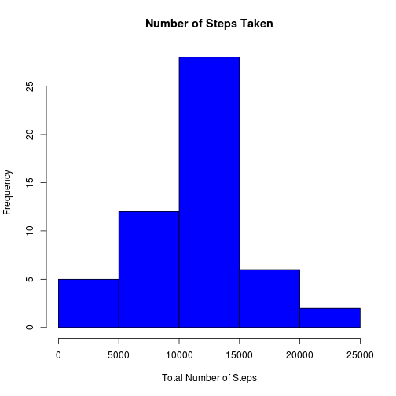
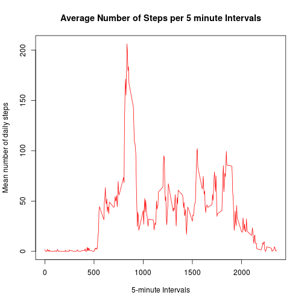
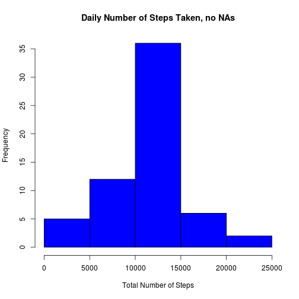
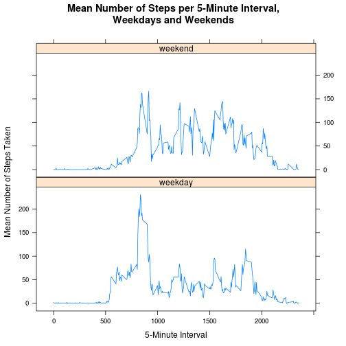

Peer Assessed Assignment 1, November 2014

## 1. Loading and preprocessing the data

We first unzip the source file and read the CSV data.


```r
unzip("activity.zip")
activ <- read.csv("activity.csv")
```
Now we need handle the date field and convert into an adequate format for our calculations.

```r
activ$date <- as.Date(activ$date, format = "%Y-%m-%d")
```

##2. What is mean total number of steps taken per day?

First, we compute the total number of steps to then produce a histogram.


```r
nsteps <-tapply(activ$steps, activ$date, sum)
```


```r
hist(nsteps, main = "Number of Steps Taken", col = "blue", xlab = "Total Number of Steps")
```

 


```r
stmean <- mean(nsteps,na.rm = T)
stmedian <- median(nsteps,na.rm = T)
```

The overall mean for steps is 10,766.2 and its median is 10,765.

##3. What is the average daily activity pattern?

First, we need to aggregate the data by interval range.


```r
msteps <- aggregate(steps ~ interval, activ, mean, na.action = na.omit)
names(msteps)[2] <- "mnsteps"
```

And then we plot the results to show the average daily patterns.


```r
 plot(msteps$interval, msteps$mnsteps, type = "l",
       xlab = "5-minute Intervals", 
       ylab = "Mean number of daily steps", 
       main = "Average Number of Steps per 5 minute Intervals",
       col = "red")
```

 

We now find the interval with the maximum number of steps below and show the results:


```r
 msteps[msteps$mnsteps == max(msteps$mnsteps),]
```

```
##     interval  mnsteps
## 104      835 206.1698
```

So interval 835 has the maximum average steps overall. The plot above shows this too, in intuitive fashion.

##4. Imputing missing values


```r
mna <- sum(is.na(activ$steps))
```

The total number is missing values or NA for our data set is 2304. 

We will use the mean number of steps by interval to replace them. 

First, we will merge our two data frames, the original and the one with the means by step to generate a new one. We will then replace the NAs with the averages.


```r
activNA <- merge(activ, msteps, by = "interval", sort = F)
activNA$steps[is.na(activNA$steps)] <- activNA$mnsteps[is.na(activNA$steps)]
```

We can now compute the new total of steps:


```r
nstepsnoNA <-tapply(activNA$steps, activNA$date, sum)
```

and then generate a new histogram.


```r
hist(nstepsnoNA, main = "Daily Number of Steps Taken, no NAs", col = "blue", 
       xlab = "Total Number of Steps")
```

 

The new mean, 10,766.2 , and new median, 10,766.2, are pretty much the same as the previous ones which included missing values. The median has increased slightly.


##5. Are there differences in activity patterns between weekdays and weekends?

To answer this question we need to manipulate the date field on the data frame with no NAs to differentiate between weekends and weekdays. We can do in this fashion:


```r
activNA$whatday <- "weekday"
weekend <- weekdays(as.Date(activNA$date)) %in% c("Saturday", "Sunday")
activNA$whatday[weekend == TRUE] <- "weekend"
activNA$whatday <- as.factor(activNA$whatday)
```

To sum up, we first add a new variable, whatday, to the data frame and give it "weekday" as default value. We then index the date field for dates that fall on either Saturday or Sunday to then replace them in the data frame. We finally define the new variable whatday as a factor.

We then aggregate the data by interval and whatday before we can compare average steps by weekday or weekend:


```r
mstepsw <- aggregate(steps ~ interval + whatday, activNA, mean)
names(mstepsw)[3] <- "mnsteps"
```

We can now plot using lattice's xyplot.


```r
library(lattice)
print(xyplot(
    mnsteps ~ interval | whatday, mstepsw, 
    type = "l",
    layout = c(1,2),
    main = "Mean Number of Steps per 5-Minute Interval,\nWeekdays and Weekends",
    xlab = "5-Minute Interval",
    ylab = "Mean Number of Steps Taken"
  ))
```

 

Clearly, the average number of steps by interval in weekends is different from that of weekdays. There is in fact more activity during weekends. 
